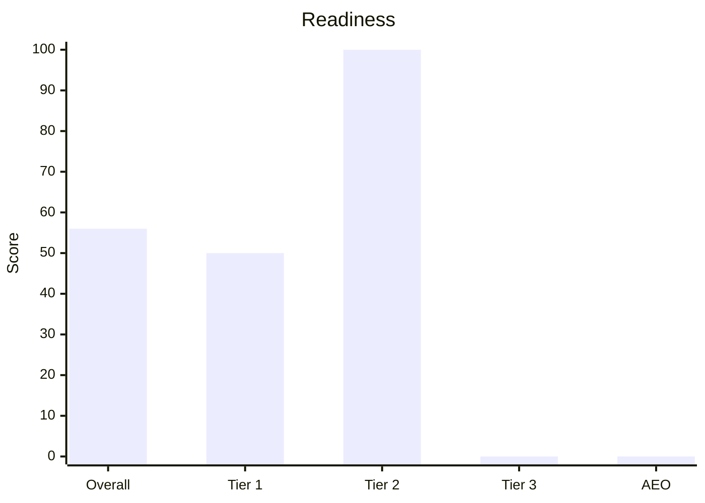

# Prerequisites
- Required: a public URL, local preview URL, or landing files. If the user gave none, ask for the target and stop.
- Helpful but optional: customer name, offer, audience, target market and locale, conversion goal, competitors, CMS, recent migration history, and linked Knowledge Base.
- Optional evidence: Google Search Console, GA4 or other analytics, Google Business Profile, Bing Webmaster Tools, rank tracking, backlink exports, and field Core Web Vitals.
- Access to rendered HTML when a check needs it. Audit what is public when private data is absent, and mark data-dependent checks Unknown.

# Steps
1. Record the customer and scope. State the target URL, whether this is one-page or site-wide, the primary conversion, market, locale, and any missing context. If several URLs are possible, identify the primary landing and the representative URLs you will sample.
2. Establish the evidence set. Inspect the rendered page, status and response headers, source HTML, `robots.txt`, XML sitemap, canonicals, metadata, structured data, internal links, mobile layout, and performance data you can actually measure.
3. Search the linked Knowledge Base and supplied exports for approved claims, target queries, terminology, competitors, and baselines. If they are absent, infer provisional query themes, label them Unconfirmed, and continue.
4. Run Tier 1, Tier 2, Tier 3, and AEO below. Use Pass, Fail, Unknown, or Not applicable. Every result needs evidence; every Fail needs impact and a concrete fix.
5. For a site-wide request, inspect templates plus a representative sample: home, the target landing, one conversion page, one content page, and localized or parameterized variants when present. List the exact URLs sampled.
6. Prioritize findings by customer impact, confidence, and effort. Put blockers before optimizations and separate quick wins from structural work.
7. Save the completed checks as JSON. Do not put a score in that file. The report script calculates it.
8. From this skill folder, run `python3 scripts/write_report_pdf.py <audit.json> --out <customer>-seo-aeo-report.pdf`. Install `fpdf2` if the script asks for it. Pass `--font` only when it cannot find a Korean-capable font.
9. Use the script's printed score, grade, coverage, and fix count in the reply. Show each score as a bar chart with the number on it. Do not invent or round a different score.
10. Stop after the PDF unless the user explicitly asked for implementation.

## SEO Tier 1 — Technical eligibility and measurement
A Fail here can prevent discovery, indexing, rendering, measurement, or conversion.

- HTTPS and a `200` (or an intentional, single-hop redirect) on the canonical URL
- The page is crawlable and indexable: no accidental `noindex`, auth wall, CDN block, robots restriction, or snippet control that conflicts with the goal
- Canonical points at the preferred URL (self-canonical when this is the original)
- XML sitemap contains canonical indexable URLs with accurate `lastmod`; `robots.txt` references it when appropriate
- Redirects, trailing slashes, protocols, host variants, parameters, and duplicate URLs resolve consistently
- Rendered HTML exposes the primary content and links to crawlers
- One unique `title` aligned with the primary query theme
- One unique meta `description` that states the offer without duplicating another route
- Exactly one `h1`, aligned with the title and the search intent
- Clean, stable URL with no session IDs or uncontrolled duplicate parameter copies
- Mobile viewport, usable mobile layout, and no blocking interstitial
- Language set (`html lang`, and `hreflang` when the site has locales)
- Core Web Vitals from field data when available; otherwise clearly labeled lab measurements
- Analytics and primary conversion tracking are present and testable, or Unknown without access
- Search Console and Bing Webmaster Tools ownership and indexing coverage when the customer provides access

## SEO Tier 2 — Relevance, experience, and conversion
This layer determines whether the landing deserves the query and satisfies the visitor.

- Search intent matches a landing page (commercial / transactional), not a blog or a docs article
- Heading hierarchy is `h1` → `h2` → `h3` with no skipped levels
- The primary query theme appears naturally in the title, H1, and opening copy without stuffing
- Supporting commercial and problem-aware themes appear only where they serve a distinct section
- Copy states who the offer is for, the problem, the differentiated outcome, proof, objections, and what happens after the CTA
- Primary CTA is visible and its destination or action works; secondary actions do not compete with it
- Images have descriptive `alt`, or empty `alt` when decorative; file names are readable
- Internal links point into the landing from relevant pages and out to pricing, proof, documentation, or policies when those pages exist
- Open Graph and Twitter metadata with a real image, title, and description
- No thin or placeholder copy on a production route
- No search-intent cannibalization against another indexable route in the sampled site
- Trust and accessibility basics support conversion: contact path, privacy/terms where required, keyboard flow, labels, contrast, and error feedback
- Local intent checks Business Profile, NAP, service area, and local proof only when the customer serves a location
- International intent checks localized canonicals and `hreflang` only when the customer targets multiple locales

## SEO Tier 3 — Authority, entities, and competitive depth
This layer tests whether the customer provides enough evidence and coverage to compete.

- Long-tail and question coverage addresses real evaluation questions without padding the page
- Entity clarity: product, company, and category names are consistent with the Knowledge Base
- Experience and trust signals identify who operates the site, how to contact them, and who produced expert claims where relevant
- Claims have visible support: examples, methodology, case studies, reviews, policies, citations, or approved customer evidence
- Structured data uses only applicable types, validates, and matches visible content. It is an eligibility aid, not a ranking or citation promise
- Supporting pages form a useful cluster around use cases, comparisons, documentation, pricing, and proof when the business needs them
- Competitor and live-SERP gaps are based on observed pages or supplied research, not remembered search results
- Backlink, mention, and reputation findings use supplied or measured data; without it they are Unknown
- Organization identity, `sameAs`, authorship, contact details, and Business Profile information agree across sources where applicable
- Freshness is truthful: stale offers and facts are fixed; dates are not changed merely to look recent

## AEO — Answer engines
Answer-engine eligibility starts with ordinary SEO. There is no required “AI schema” or AI text file.

- The page is indexable and eligible to show a search snippet; crawl and snippet controls match the customer’s desired participation
- Important content is available as visible text, not only inside images, video, canvas, or interaction-only UI
- A concise passage explains what the offer is, who it is for, and the outcome in factual language
- Question-led sections answer genuine customer questions directly before expanding with proof or detail
- Answers are complete on the page rather than “contact us” teasers, and each section stays focused on one topic
- Quotable facts — category, compatibility, location, pricing model, process, and comparisons — are approved, current, and supported
- Hero, body, FAQ, metadata, structured data, Merchant Center, and Business Profile do not contradict one another when applicable
- Structured data matches visible content and eligible rich-result types; special AEO markup is not required
- Snippet directives (`nosnippet`, `data-nosnippet`, `max-snippet`, Bing cache controls) do not unintentionally suppress useful citations
- Fresh changes are discoverable through accurate sitemaps and, where supported, IndexNow
- Google Search Console and Bing Webmaster Tools AI/citation reports are reviewed when the customer provides access; citation counts are not treated as rankings
- `llms.txt` is optional. Its absence is not a Fail, and its presence is checked only for accuracy and contradictions

# Report
Use this shape. Keep site-wide and page-specific findings distinguishable.

```markdown
# Landing SEO / AEO audit
Customer:
Primary URL:
Scope and sampled URLs:
Market / locale / conversion:
Evidence available:
Evidence missing:
Query source: customer data | Knowledge Base | inferred (unconfirmed)

## Executive verdict
- Overall readiness:
- Largest business risk:
- Highest-leverage opportunity:

## Scorecard
| Layer | Pass | Fail | Unknown | Not applicable |
|---|---:|---:|---:|---:|
| SEO Tier 1 | | | | |
| SEO Tier 2 | | | | |
| SEO Tier 3 | | | | |
| AEO | | | | |

## SEO Tier 1
| Check | Scope | Result | Evidence | Customer impact | Fix | Owner | Verify |
|---|---|---|---|---|---|---|---|
| | | | | | | | |

## SEO Tier 2
| Check | Scope | Result | Evidence | Customer impact | Fix | Owner | Verify |
|---|---|---|---|---|---|---|---|
| | | | | | | | |

## SEO Tier 3
| Check | Scope | Result | Evidence | Customer impact | Fix | Owner | Verify |
|---|---|---|---|---|---|---|---|
| | | | | | | | |

## AEO
| Check | Scope | Result | Evidence | Customer impact | Fix | Owner | Verify |
|---|---|---|---|---|---|---|---|
| | | | | | | | |

## Prioritized actions
| Priority | Action | Impact | Confidence | Effort | Owner |
|---|---|---|---|---|---|
| | | | | | |

## 30 / 60 / 90 days
- 0–30 days:
- 31–60 days:
- 61–90 days:

## Measurement plan
- Baseline:
- KPI:
- Recheck date:
```

## Audit JSON
Write one object. `language` is `ko` or `en`. `layer` is `tier1`, `tier2`, `tier3`, or `aeo`. `result` is `pass`, `fail`, `unknown`, or `na`.

```json
{
  "language": "ko",
  "customer": "Northwind",
  "url": "https://example.com",
  "auditedAt": "2026-10-08",
  "scope": "Homepage and pricing page",
  "verdict": "Indexable, but the offer is hard to quote.",
  "plan": { "d30": ["Fix the canonical"], "d60": [], "d90": [] },
  "checks": [
    {
      "layer": "tier1",
      "check": "Canonical points at the preferred URL",
      "result": "fail",
      "impact": "high",
      "evidence": "https://example.com canonical is https://example.com/home",
      "fix": "Make the landing self-canonical."
    }
  ]
}
```

# Gotchas
- A missing Knowledge Base or private analytics access does not block the public audit. Label the limitation and continue.
- Preview or auth-walled URLs are often `noindex`. Do not Fail a production URL for a preview header you saw on staging unless they are the same URL.
- Client-rendered titles can differ from the static file. Prefer the rendered document when you can fetch it.
- AEO is not “add FAQ schema.” Google does not require special AI markup, and schema never guarantees a citation.
- Do not apply `FAQPage` merely because the page has questions. Use only markup that is applicable, supported, visible, and valid.
- Do not compare customers against remembered rankings. Use live evidence or mark the comparison Unknown.
- The readiness score belongs to `scripts/write_report_pdf.py`. A hand-written score is not the report.
- A score without its graph is not a report. Use the PDF graphs, and repeat the same values in the reply as a bar chart.

# Output
**Deliverable** — The script's PDF, with score graphs beside the numbers, and a numbered list of what to fix.
**Done when** — The PDF exists, its score matches the script output, the reply shows those same scores as a bar chart, every applicable check has evidence, and no ranking or citation is promised.

In the reply, use the script's numbers in this chart. Replace only the values. A missing layer score is `0` and the caption says it was not scored.


